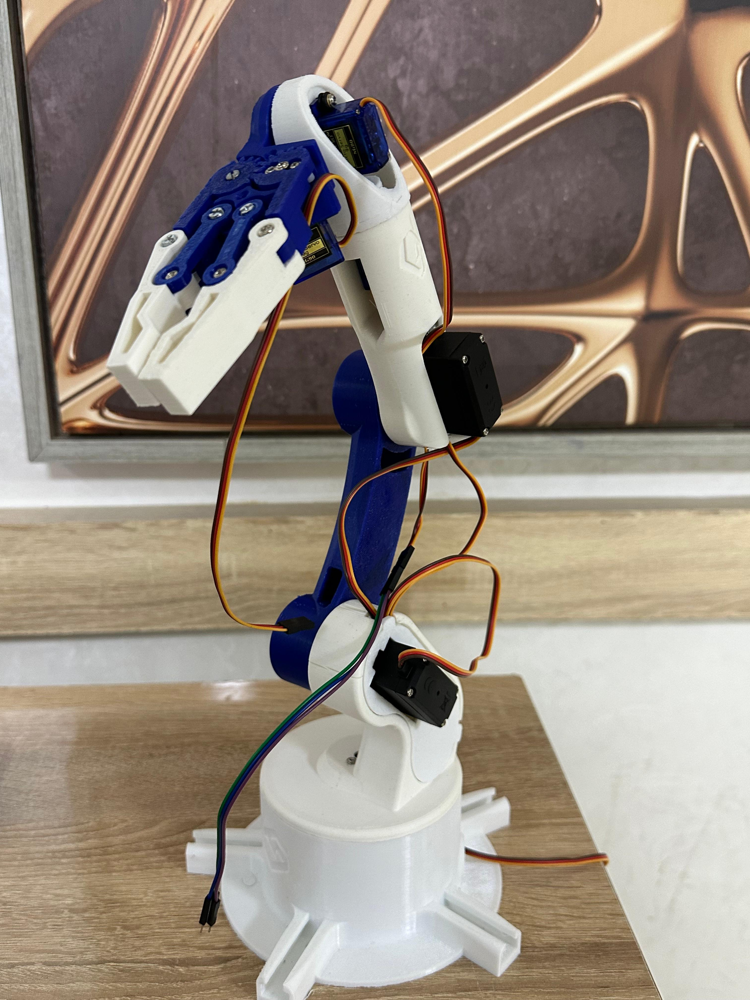

# 4-DOF Robotic Arm Project

## Project Overview
This project is part of the **Robotics & Cobotics** program at the **EuroMed University of Fez**, under the **Digital Engineering and Artificial Intelligence School (EIDIA)**. It focuses on the design, modeling, and implementation of a **4-Degree-of-Freedom (DOF) robotic arm**. The project was developed during the **2024-2025 academic year** as part of the **Conception and Modeling of Robotic Systems** module.

### Supervised by:
- **Prof. Zakaria Chalh**

### Developed by:
- **Omar EL ALAOUI**
- **Mohamed BOFARHA**
- **Bouarfa LAHMR**
- **Hiba MOUHSINE**

---

## Table of Contents
1. [Executive Summary](#executive-summary)
2. [Introduction](#introduction)
3. [Mechanical Design](#mechanical-design)
4. [Kinematics](#kinematics)
5. [Prototyping and Fabrication](#prototyping-and-fabrication)
6. [Electronic Architecture and Control](#electronic-architecture-and-control)
7. [Programming](#programming)
8. [Simulation](#simulation)
9. [Constraints and Limitations](#constraints-and-limitations)
10. [Results and Discussion](#results-and-discussion)
11. [Conclusion and Future Work](#conclusion-and-future-work)

---

## Executive Summary
This project involves the design and implementation of a **4-DOF robotic arm** capable of precise manipulation tasks. The goal was to integrate mechanical, electronic, and programming solutions to create a functional robotic system. Key steps included:
- Theoretical study of forward and inverse kinematics.
- 3D CAD modeling and 3D printing for prototyping.
- Development of a control system using a Raspberry Pi 4 and Python programming.
- Simulation and validation using tools like RViz and Gazebo.

Despite time and resource constraints, the project successfully demonstrated the application of robotic principles and opened avenues for future improvements in industrial automation and complex object manipulation.

---

## Introduction
### Context and Motivation
Automation is a cornerstone of modern industrial innovation, with robotic arms playing a critical role in tasks requiring precision and efficiency. This project aims to apply theoretical knowledge to the design and implementation of a functional robotic system, addressing the growing demand for robotics expertise in modern industries.

### Project Objectives
The primary goal is to design and build a **4-DOF robotic arm** with the following specific objectives:
- **Mechanical Design**: Develop a robust and flexible structure.
- **Kinematics**: Apply forward and inverse kinematics for precise movements.
- **Prototyping and Fabrication**: Use 3D printing for component fabrication.
- **Electronic Architecture and Control**: Integrate a high-performance control system.
- **Programming and Simulation**: Develop control software and validate through simulations.

---

## Mechanical Design
### Degrees of Freedom (DOF)
The 4-DOF configuration was chosen to balance complexity, cost, and performance, ensuring flexibility and precision in movements.

### CAD Modeling
A 3D model was adapted using CAD tools, ensuring compatibility with 3D printing and modular assembly. This allowed for pre-fabrication simulation and error correction.
- 

### Drive Systems
- **MG995 Servomotors**: Used for high-torque joints.
- **MG90 Servomotors**: Used for fine and rapid movements.

---

## Kinematics
### Theoretical Kinematics
Forward and inverse kinematics were studied to ensure precise control of the robotic arm's movements.

### Denavit-Hartenberg (DH) Table
The DH method was used to model the geometric relationships between the arm's segments.

### Forward Kinematics
The position and orientation of the end-effector were calculated using homogeneous transformation matrices.

### Inverse Kinematics
Equations were solved to determine joint angles required to reach specific positions.

---

## Prototyping and Fabrication
### 3D Printing
An existing 3D model was adapted and printed using a 3D printer.
- 

### Assembly
Components were assembled with servomotors, gears, and electronic modules, ensuring proper cable management.
- 

---

## Electronic Architecture and Control
### Microcontroller
A **Raspberry Pi 4** was used for its high performance and compatibility with sensors and actuators.

### Power Supply
- **7.4V Lithium Batteries**: Provided stable power.
- **PCA9685**: Used for motor control.
- **XL4015**: Voltage regulator for stable power management.

---

## Programming
### Programming Language
**Python** was chosen for its simplicity and rich libraries.

### Motor Control
The **RPi.GPIO** library was used to control servomotors via PWM signals.

### User Interface
A simple GUI was developed using **Tkinter** for real-time control and trajectory planning.

---

## Simulation
### RViz and Gazebo
Simulations were conducted to validate the robotic arm's behavior in a virtual environment before physical implementation.
- 

---

## Constraints and Limitations
### Constraints
1. **Time Constraints**: Limited the scope of advanced functionalities.
2. **Material Constraints**: Unplanned component purchases added delays.
3. **Power Management**: Required voltage regulators for stable operation.
4. **Raspberry Pi Learning Curve**: Initial unfamiliarity with the microcontroller.
5. **Camera Limitations**: Low resolution and processing power affected computer vision tasks.
6. **Kinematic Complexity**: Required careful calculation of homogeneous matrices.
7. **Assembly Challenges**: Required adjustments for proper motor and joint alignment.

### Limitations
1. **Movement Precision**: Mechanical limitations affected fine tasks.
2. **Processing Power**: Limited real-time data processing for complex tasks.
3. **Component Durability**: Servomotors showed signs of wear.
4. **Software Limitations**: Python and OpenCV had limitations for advanced computer vision tasks.
5. **Environmental Adaptation**: Designed primarily for lab environments.

---

## Results and Discussion
### Performance
The robotic arm achieved precise movements with an error margin of less than 2 cm. Adjustments were made to optimize motor control and stability.

### Kinematic Analysis
Forward and inverse kinematics were successfully applied, though singularities caused issues in complex configurations.

### Impact of Constraints
Material and time constraints limited advanced testing, but core objectives were achieved.

---

## Conclusion and Future Work
### Conclusion
The project successfully demonstrated the design and implementation of a 4-DOF robotic arm, applying theoretical concepts to a practical system.

### Future Work
- **Improved Precision**: Add encoders or force sensors.
- **Advanced Features**: Integrate machine learning for motion planning.
- **Power and Communication**: Enhance power management and error handling.
- **Durability**: Use more robust servomotors for long-term use.

---

For more details, visit the [full report](rapport.pdf) (French version).
